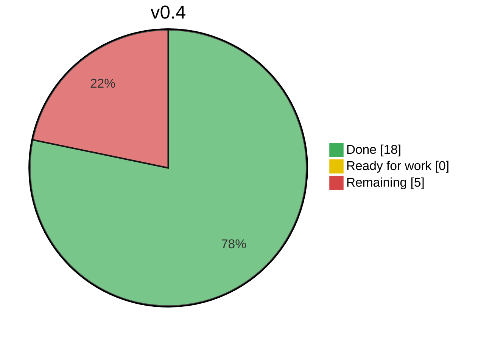
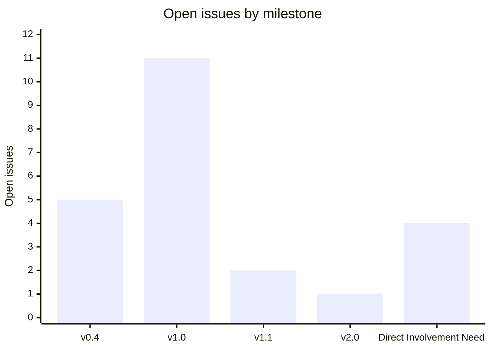

<!-- pipeline-focus: v0.4 -->

_Auto-generated by the dashboard workflow — do not edit by hand; it is rewritten on a schedule and never closed._

**As of:** 2026-07-17 07:00 CT · **Focus milestone:** `v0.4`

## 🎯 Focus milestone — `v0.4`
**18 / 23 complete**

**▶️ Ready-for-work queue** _(this milestone only, in nightly build order)_

_Nothing queued yet. `/approve` an analysis into this milestone and it lands here, blockers first. Set the active milestone anytime with `/focus <milestone>`._

---

### 🔔 Your move
| Queue | Count |
| - | - |
| 🔀 PRs awaiting your merge | **0** (+1 release-please, below) |
| 🆕 New ideas to `/admit` | **2** |
| ✅ Analyses to `/approve` | **3** |
| ❓ Questions to answer | **1** |

---

## 🔀 Pull requests

**Awaiting your merge:** _none right now._

**Automation (separate cadence):**

| PR | Title | State |
| - | - | - |
| [#111](https://github.com/derekwinters/lucas-doggiehood/pull/111) | `chore(main): release 0.3.0` | release-please — merge to cut the release |

---

## 🆕 New ideas — awaiting your call
_Raw, ungated issues. `/admit` pulls one into analysis · `/park` hides it._

| Issue | Summary |
| - | - |
| [#180](https://github.com/derekwinters/lucas-doggiehood/issues/180) | Dogs playing in yard |
| [#192](https://github.com/derekwinters/lucas-doggiehood/issues/192) | Rework milestones into version-numbered scopes (pre-v1 functionality/polish cycles) |

> **Your move:** `/admit` · `/park`

---

## ✅ Pending approval — analysis done, awaiting you
_AI has triaged these; read the analysis on each, then act._

| Issue | Summary |
| - | - |
| [#186](https://github.com/derekwinters/lucas-doggiehood/issues/186) | Buy-something quest: no way to actually buy the item from the conversation panel |
| [#181](https://github.com/derekwinters/lucas-doggiehood/issues/181) | Lost Dog |
| [#163](https://github.com/derekwinters/lucas-doggiehood/issues/163) | Make EditMode tests required |

> **Your move:** `/approve` (→ ready-for-work, milestone as proposed) · `/revise <notes>` · `/redo` · `/park`

---

## ❓ Needs clarification — blocked on your answer
_A specific question is posted on each issue — open it to read and reply._

| Issue | Summary |
| - | - |
| [#185](https://github.com/derekwinters/lucas-doggiehood/issues/185) | Conversation panel has no way to decline/say no to a quest request |

> **Your move:** `/revise <notes>` · `/redo` · `/propose` · `/park`

---

## 📦 Other milestones
_Live counts for every milestone outside the current focus._

| Milestone | Progress | |
| - | - | - |
| `v1.0` | `▰▰▱▱▱▱▱▱▱▱` | 3/14 complete · 11 open |
| `v1.1` | `▱▱▱▱▱▱▱▱▱▱` | 0/2 complete · 2 open |
| `v2.0` | `▱▱▱▱▱▱▱▱▱▱` | 0/1 complete · 1 open |
| `Direct Involvement Needed` | `▰▰▰▰▰▰▰▰▱▱` | 13/17 complete · 4 open |

---

## 📈 Open issues by milestone

---

### 📖 Command reference
Comment on any issue (only Derek's commands are honored):

| Command | Effect |
| - | - |
| `/admit` | Pull a raw idea into AI analysis |
| `/approve` | Accept the analysis → ready-for-work, sets proposed milestone |
| `/revise <notes>` | Send back to analysis with your feedback |
| `/redo` | Discard the analysis and start it over |
| `/propose` | Authorize AI to draft the missing design/wireframe as a proposal |
| `/park` / `/unpark` | Hide from the pipeline / bring it back |
| `/milestone <name>` | Override the milestone |
| `/focus <name>` | Set the active milestone for nightly development |
