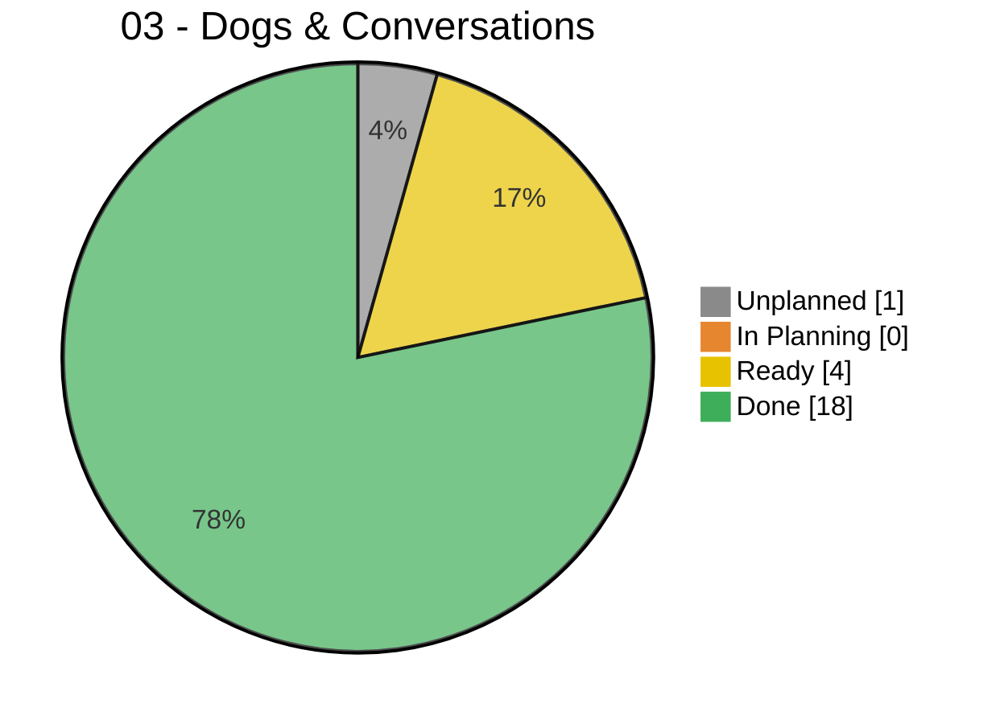
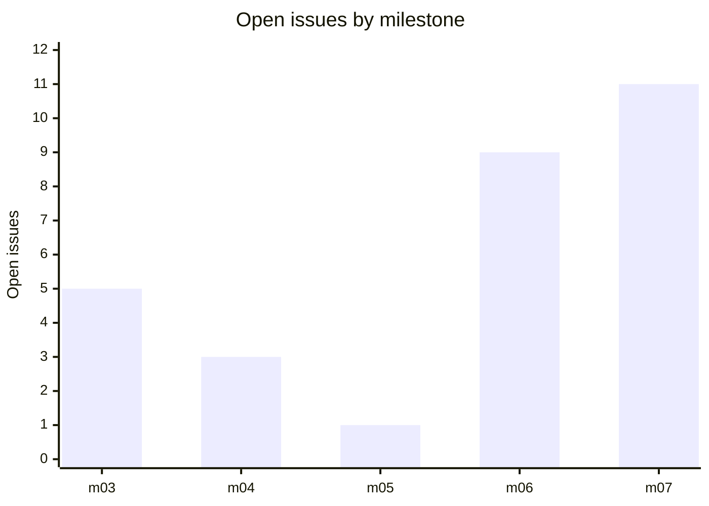

<!-- pipeline-focus: 03 - Dogs & Conversations -->
<!-- pipeline-cap: 5 -->

_Auto-generated by the dashboard workflow — do not edit by hand; it is rewritten on a schedule and never closed._

**As of:** 2026-07-17 07:00 CT · **Focus milestone:** `03 - Dogs & Conversations`

## 🎯 Focus milestone — `03 - Dogs & Conversations`
**18 / 23 complete**

```mermaid
%%{init: {"themeVariables": {"pie1": "#8a8a8a", "pie2": "#e6862e", "pie3": "#e6c200", "pie4": "#3fae5a"}}}%%
pie showData title 03 - Dogs & Conversations
    "Unplanned" : 1
    "In Planning" : 0
    "Ready" : 4
    "Done" : 18
```

**▶️ Ready-for-work queue** _(this milestone only, in nightly build order)_

Nightly build cap: **5**

| Issue | Title | Milestone | |
| - | - | - | - |
| [#109](https://github.com/derekwinters/lucas-doggiehood/issues/109) | Tile grid foundation | 03 - Dogs & Conversations | ⭐ unblocks [#57](https://github.com/derekwinters/lucas-doggiehood/issues/57), [#58](https://github.com/derekwinters/lucas-doggiehood/issues/58), [#178](https://github.com/derekwinters/lucas-doggiehood/issues/178) |
| [#210](https://github.com/derekwinters/lucas-doggiehood/issues/210) | Standalone bark sound polish | 03 - Dogs & Conversations | |
| [#205](https://github.com/derekwinters/lucas-doggiehood/issues/205) | Quest reward wiring | 03 - Dogs & Conversations | ⛔ _blocked_ |

---

### 🔔 Your move
| Queue | Count |
| - | - |
| 🔀 PRs awaiting your merge | **0** |
| 🆕 New ideas to `/admit` | **2** |
| ✅ Analyses to `/approve` | **3** |
| ❓ Questions to answer | **1** |

---

## 🔀 Pull requests

**Awaiting your merge:** _none right now._

**Automation (separate cadence):**

| PR | Title | State |
| - | - | - |
| [#111](https://github.com/derekwinters/lucas-doggiehood/pull/111) | `chore(main): release 0.3.0` | release-please — merge to cut the release |

---

## 🆕 New ideas — awaiting your call
_Raw, ungated issues. `/admit` pulls one into analysis · `/park` hides it._

| Issue | Summary | Milestone | Blocked by |
| - | - | - | - |
| [#180](https://github.com/derekwinters/lucas-doggiehood/issues/180) | Dogs playing in yard |  |  |
| [#192](https://github.com/derekwinters/lucas-doggiehood/issues/192) | Rework milestones into version-numbered scopes (pre-v1 functionality/polish cycles) | 07 - Polish & Onboarding | [#180](https://github.com/derekwinters/lucas-doggiehood/issues/180) |

> **Your move:** `/admit` · `/park`

---

## ✅ Pending approval — analysis done, awaiting you
_AI has triaged these; read the analysis on each, then act._

| Issue | Summary | Milestone | Blocked by |
| - | - | - | - |
| [#186](https://github.com/derekwinters/lucas-doggiehood/issues/186) | Buy-something quest: no way to actually buy the item from the conversation panel | 03 - Dogs & Conversations |  |
| [#181](https://github.com/derekwinters/lucas-doggiehood/issues/181) | Lost Dog | 04 - Quests & Economy | [#186](https://github.com/derekwinters/lucas-doggiehood/issues/186) |
| [#163](https://github.com/derekwinters/lucas-doggiehood/issues/163) | Make EditMode tests required |  |  |

> **Your move:** `/approve` (→ ready-for-work; milestone already set by analysis) · `/revise <notes>` · `/redo` · `/park`

---

## ❓ Needs clarification — blocked on your answer
_A specific question is posted on each issue — open it to read and reply._

| Issue | Summary | Milestone | Blocked by |
| - | - | - | - |
| [#185](https://github.com/derekwinters/lucas-doggiehood/issues/185) | Conversation panel has no way to decline/say no to a quest request | 03 - Dogs & Conversations | [#186](https://github.com/derekwinters/lucas-doggiehood/issues/186) |

> **Your move:** `/revise <notes>` · `/redo` · `/propose` · `/park`

---

## ⏸️ Parked
_Hidden from the pipeline and every active queue above. `/unpark` brings one back into intake._

| Issue | Summary | Milestone |
| - | - | - |
| [#172](https://github.com/derekwinters/lucas-doggiehood/issues/172) | Seasonal weather effects | 05 - Decorations & Happiness |

---

## ⚠️ Reconcile — board drifted from reality
_Detected by the reconciliation sweep. Auto-fixes (stale-label strips, requeues) are applied by the gatekeeper; the items below need your call._

**🔀 Merged but still open** — the work is on `main`; close these (#211 auto-closes the clean cases once it lands):

| Issue | Summary |
| - | - |
| [#56](https://github.com/derekwinters/lucas-doggiehood/issues/56) | Pity counter for gacha pulls |
| [#189](https://github.com/derekwinters/lucas-doggiehood/issues/189) | Opener/closer conversation lines |

**🏷️ Ready-for-work with no milestone** — set one so the builder can queue it:

| Issue | Summary |
| - | - |
| [#250](https://github.com/derekwinters/lucas-doggiehood/issues/250) | Ready-for-work issue with no milestone set |

**🔗 Prose-only dependency references** — record as structured `Blocked by:` / `Depends on:` so the queue can order them:

| Issue | Summary | References |
| - | - | - |
| [#178](https://github.com/derekwinters/lucas-doggiehood/issues/178) | Depends on the tile grid in prose | [#109](https://github.com/derekwinters/lucas-doggiehood/issues/109) |

_Sweep auto-fixed this run: 2 stale-label strip(s), 1 requeue(s)._

---

## 📦 Other milestones
_Live counts for every milestone outside the current focus._

| Milestone | Progress | |
| - | - | - |
| `04 - Quests & Economy` | `▰▰▰▰▰▰▰▰▰▱` | 18/21 complete · 3 open |
| `05 - Decorations & Happiness` | `▰▰▰▰▰▰▰▰▰▱` | 8/9 complete · 1 open |
| `07 - Polish & Onboarding` | `▰▰▱▱▱▱▱▱▱▱` | 3/14 complete · 11 open |
| `06 - Neighborhood Expansion` | `▰▱▱▱▱▱▱▱▱▱` | 1/10 complete · 9 open · _post-MVP_ |

---

## 📈 Open issues by milestone

```mermaid
xychart-beta
    title "Open issues by milestone"
    x-axis [m03, m04, m05, m06, m07]
    y-axis "Open issues" 0 --> 12
    bar [5, 3, 1, 9, 11]
```

---

### 📖 Command reference
Comment on any issue (only Derek's commands are honored):

| Command | Effect |
| - | - |
| `/admit` | Pull a raw idea into AI analysis |
| `/approve` | Accept the analysis → ready-for-work (milestone already set by analysis) |
| `/revise <notes>` | Send back to analysis with your feedback |
| `/redo` | Discard the analysis and start it over |
| `/propose` | Authorize AI to draft the missing design/wireframe as a proposal |
| `/park` / `/unpark` | Hide from the pipeline / bring it back |
| `/milestone <name>` | Override the milestone |
| `/focus <name>` | Set the active milestone for nightly development |
| `/cap <n>` | Set the nightly dev build cap (this dashboard issue only) |

_`/focus` can be set from any issue **or from this dashboard issue** — the gatekeeper honors it here even though every other command is issue-scoped. Relocating this focus marker to a dedicated single-writer store (a control issue or a repo variable) is tracked as decision #8._

_`/cap <n>` is honored **only on this dashboard issue** — a positive integer sets the nightly build cap; non-numeric or non-positive input is rejected and the cap is left unchanged._
